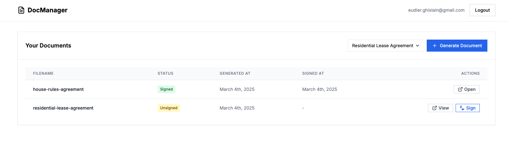
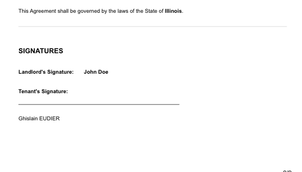

# PDF Generator & Signing Application

A secure microservice-based application built with NestJS for generating and digitally signing PDF documents.

## Features

- PDF document generation from templates
- Digital document signing
- Secure user authentication with JWT
- Microservices architecture
- Document storage and management

## How It Works

This application uses a microservices architecture with the following components:

1. **Authentication Service**: Handles user registration, login, and JWT token management
2. **Database Service**: Manages all database operations and document metadata
3. **Files Handler Service**: Generates PDFs and manages document signing
4. **Frontend**: Provides an intuitive user interface

## Documents

Users can generate and sign various document types including:

- Residential lease agreements
- House rules agreements
- And more...

### Example of a Signed Document

## Technical Stack

- **Backend**: NestJS microservices
- **Database**: PostgreSQL with Sequelize ORM
- **Storage**: MinIO object storage
- **Authentication**: JWT-based security
- **PDF Generation**: Headless Chrome / Puppeteer
- **Frontend**: React/Next.js

## Getting Started

1. Ensure Docker and Docker Compose are installed
2. Clone the repository
3. Run `docker-compose up`
4. Access the application at `http://localhost:3001`